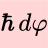

HdT
===

A handy PdF viewer with the possibility to scribble over pages.
Uses `SVG` overlays editable with [Inkscape](https://inkscape.org/)

Installation
------------

### Install Inkscape and some command line tools

The command line tools [pdftocairo](https://manpages.debian.org/bookworm/poppler-utils/pdftocairo.1.en.html) and
[xmlstarlet](https://en.wikipedia.org/wiki/XMLStarlet) should be installed.

And [Inkscape](https://inkscape.org/).

### Install and configure HdT

I recommend using the [Nix package manager](https://en.wikipedia.org/wiki/Nix_%28package_manager%29)
Once it is installed, `cd` to this directory and say:

    nix profile install .

The binary `hdtview` will be put in `~/.nix-profile/bin/hdtview`.

The configuration directory is `~/.config/HdTPDFViewer/`.
If this directory is not present, it will be created at the first run.

Use
---

### Two files and a folder

Suppose that we are looking at a `.pdf` file, _e.g._ :

    /home/andrei/papers/paper.pdf

When we first run `hdtview` on this file, it will create an `XML` file with the extension `.pdq`. Now we have two files:

    /home/andrei/papers/paper.pdf
    /home/andrei/papers/paper.pdq

The `.pdq` file contains bookmarks and notes. If we also want to scribble over, we create a folder with the extension `.hdt`;
now we have two files and a folder:

    /home/andrei/papers/paper.pdf
    /home/andrei/papers/paper.pdq
    /home/andrei/papers/paper.hdt/

### Scribble over pages with Inkscape

To create an __SVG overlay__ over page 3, do this:

    cd /home/andrei/papers/paper.hdt/
    hdtview -e 3
    inkscape p3.svg &

There is also the ✍ button, which automates this.

While drawing in Inkscape, make sure that you draw on the layer with the id: `layer1`.
This should be automatic, just double-check.
The layer has label `hdt` and id `layer1`; if you look inside the `p<n>.svg` file the tag should be something like:

    <g inkscape:label="hdt" inkscape:groupmode="layer" id="layer1">

Inkscape, in its  layers' panel, shows label (not id), so it will be called `hdt` in the layer's panel.
It is the `layer1` that becomes the overlay, when viewing the `paper.pdf`.
The overlays are all in `paper.hdt/`, named `p<n>.svg`, where `n` is the page number.

### Global setting can be overwritten on a per-pdf-file basis

To ovewrite settings, put the corresponding keys in  `/home/andrei/papers/paper.hdt/config.dhall`. For example:

    {
     initialScale = 1.3
     }

-- this will overwrite the `initialScale` setting in `~/.config/HdTPDFViewer/config.dhall` specially for the `paper.pdf` file.

### Keyboard shortcuts

    Action                                    Keyboard Shortcut   Button
    Reload file                               Ctrl-l              ↺
    Next Page                                 n                   ⇨
    Previous Page                             p                   ⇦
    Scroll Up Slow                            k
    Scroll Up Fast                            Shift-k
    Scroll Down Slow                          j
    Scroll Down Fast                          Shift-j
    Scroll Left Slow                          h
    Scroll Left Fast                          Shift-h
    Scroll Right Slow                         l
    Scroll Right Fast                         Shift-l
    Zoom In                                   .                   ⊕
    Zoom Out                                  ,                   ⊖
    Go back after jump                        b                   🔙
    Enter search term                         /                   🔍
    Look for matches on next pages            Ctrl-n              𝒩
    Look for matches on previous pages        Ctrl-p              𝒫
    Return to the page where search started   Ctrl-g
    Toggle highlight of search matches        F1
    Extract text on this page                 t                   T
    Copy path to filename.pdf to clipboard    c
    Copy path to filename.hdt to clipboard    d

### Working with bookmarks

    Add bookmark                              a
    Open bookmarks                            Ctrl-b

Bookmarks are labelled by letters ("charhints", like in [Tridactyl](https://addons.mozilla.org/en-US/firefox/addon/tridactyl-vim/)).
To navigate to the bookmark, press the corresponding key. To delete the bookmark, press that key with `Shift` (like upcase).

### Notes and annotations

Notes (as bookmarks) are stored in the `.pdq` file, while annotations are stored in the `.pdf` file itself.
(Annotations are a standard feature of `PDF` files, while notes are a feature of `hdt`.)

To add a note, right-click on the document where you want the note marker to be. The dialog will come up.
If you right-click on an already existing note, the dialog will be pre-filled with the previous note,
and on clicking `OK` it will replace it. If you click on `move` instead of `OK`, then the note will disappear from the page,
but will be remembered, and will come up at the next right-click. This is how to move them.

Annotations are work in progress, for now.
